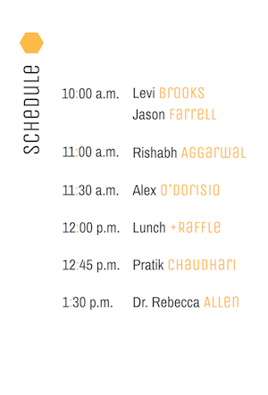
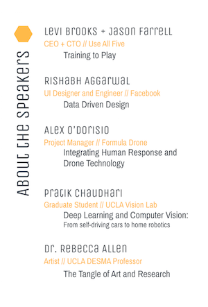
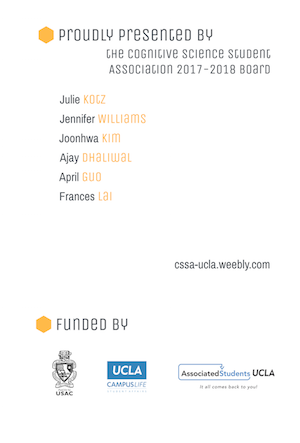

# CSSA Redesign
This project was a brand redesign for my club, the Cognitive Science Student Association at UCLA. In the past, our club did not adhere to a consistent design style or seek to have any cohesion in designs for our website, Facebook page, or flyers/printed materials. I took the initiative to change this and create a new brand identity that would be exciting to potential new members but still be representative of the club and its goals. For all of these designs/images, I used the free prototype/design tool [Figma](https://www.figma.com/).

First, I wanted to get input from the rest of my fellow board members about what CSSA's brand identity should embody. We brainstormed the following keywords: **innovative**, **curious**, **creative**, **bold**. 

With these words in mind I began thinking about the style guide, which would include fonts and colors that will be used across all designs. I wanted colors that were bold but still cohesive when used together so I used [Coolors](https://coolors.co/), a free color scheme generator, to browse color schemes. For fonts, I wanted a primary and secondary font, both of which were sans-serif, more angled than round, and definitely **not** boring or typical. This was to represent the technology-savvy and innovative aspect of cognitive science and our club. 

With all these ideas in mind, I came up with this style guide:

Next, I began thinking about the club logo and other shapes that would be utilized in designs. Here is my preliminary sketch sheet:

As you can see, my main inspirations were:
- the human brain (the outline, views from different perspectives)
- the letters: CSSA
- cogntive science itself; specifically its interdisciplinary nature and the 6 divisions that make it up (psychology, linguistics, computer science/artifical intelligence, neuroscience, philosophy, anthropology)
- minimalism

From this brainstorm, I wanted my design to combine the idea of the connectivity between the 6 divisions and an image of the brain. 

First, the 6 divisions of cognitive science. I was inspired by the general look of the diagrams that come up when you google "cognitive science". These visualizations essentially show the connections between the divisions in a six-sided star within a hexagon shape:

Keeping with the minmalist mindset, I decided that using small hexagons would be an visually interesting avenue to take for the design. Here is my hexagon, meant to be used in any of our brand colors:

Now, I wanted to combine these small hexagons with a brain. Many logos use the side view of the brain, so I decided it would be more **innovative** and **creative** to use the top-down view instead. And that is how this logo was born:

***

## Here are some examples of the designs that I created using this style guide:

### Our Cover Photo for the Facebook Page

Here I wanted to specifically focus on the divisions of cognitive science so people visiting the page immediately know what cogntive science entails. The design is has a hint of fun and whimsy but the shapes and minmalism ensure that **science** and **education** are the main focus.

## CSSA's Annual Symposium: Graphics and Advertising
This event is put on every year by CSSA and it is extremely important for our advertising and graphic materials to be informative as well as eye-catching.

### FB Event Cover Photo 

### Event Program

